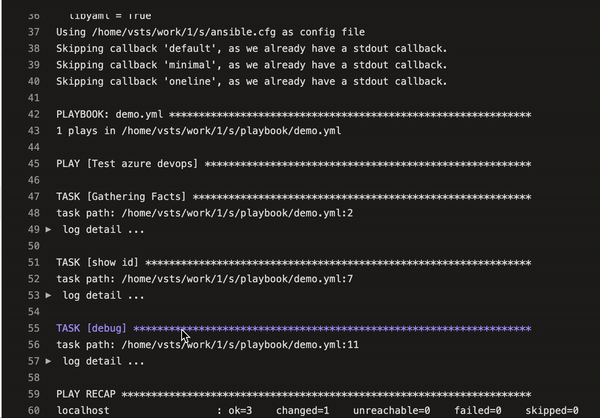

# Ansible Collection - derfzitnux.azdevopslog

Documentation for the collection.

## Install
```
ansible-galaxy collection install derf974.azdevopslog
```

## Configuration

in your ansible.cfg, add:
```ini
[defaults]
callbacks_enabled = derf974.azdevopslog.azdevopslog
```

ansible version < 2.15
```ini
[defaults]
callback_whitelist = derf974.azdevopslog.azdevopslog
```

## demo


